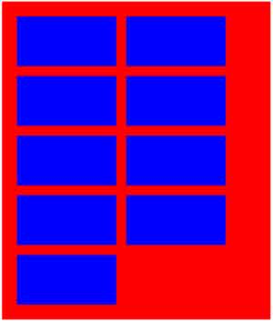

## 6. 盒模型及定位

### 6.1 任务描述

在`task0001.html`中，实践以下内容：

- 用两种方法来实现一个背景色为`红色`、宽度为`960px`的`
`在浏览器中居中
- 有的圆角矩形是复杂图案，无法直接用border-radius，请在不使用border-radius的情况下实现一个可复用的高度和宽度都自适应的圆角矩形 
- 用两种不同的方法来实现一个两列布局，其中左侧部分宽度固定、右侧部分宽度随浏览器宽度的变化而自适应变化 
- 用两种不同的方式来实现一个三列布局，其中左侧和右侧的部分宽度固定，中间部分宽度随浏览器宽度的变化而自适应变化
- 实现一个浮动布局，红色容器中每一行的蓝色容器数量随着浏览器宽度的变化而变化  

### 6.2 期望达成

- 掌握块状元素、内联元素、和内联块状元素的概念与区别
- 掌握盒模型的所有概念，学会如何计算各种盒模型相关的数值
- 掌握`position`的相关知识
- 掌握`float`的相关知识
- 掌握基本的布局方式
- 了解`Grid`、`Flexbox`等布局方式

### 6.3 参考资料

- [w3school](http://w3school.com.cn/css/css_boxmodel.asp)
- [MDN](https://developer.mozilla.org/zh-CN/docs/CSS/%E5%BC%80%E5%A7%8B/Boxes)
- [慕课网](http://www.imooc.com/code/2047)
- [w3school](http://w3school.com.cn/css/css_positioning.asp)
- [慕课网](http://www.imooc.com/code/2057)
- [学习CSS布局](http://zh.learnlayout.com/no-layout.html)
- [CSS布局方式](http://teamtreehouse.com/library/css-layout-techniques)
- [双飞翼布局介绍-始于淘宝UED](http://www.imooc.com/wenda/detail/254035)
- [W3C Visual formatting model](http://www.w3.org/TR/CSS21/visuren.html#)
- [MDN Visual formatting model](https://developer.mozilla.org/en-US/docs/Web/Guide/CSS/Visual_formatting_model)
- [CSS 101: Block Formatting Context](http://www.yuiblog.com/blog/2010/05/19/css-101-block-formatting-contexts)
- [Block Formatting Context In CSS](http://outofmemory.cn/wr/?u=http%3A%2F%2Fkkeys.me%2Fpost%2F68547473290)
- [A new micro clearfix hack](http://nicolasgallagher.com/micro-clearfix-hack/)
- [那些年我们一起清除过的浮动 by 一丝冰凉](http://www.iyunlu.com/view/css-xhtml/55.html)
- [BFC和hasLayout](http://www.cnblogs.com/pigtail/archive/2013/01/23/2871627.html)
